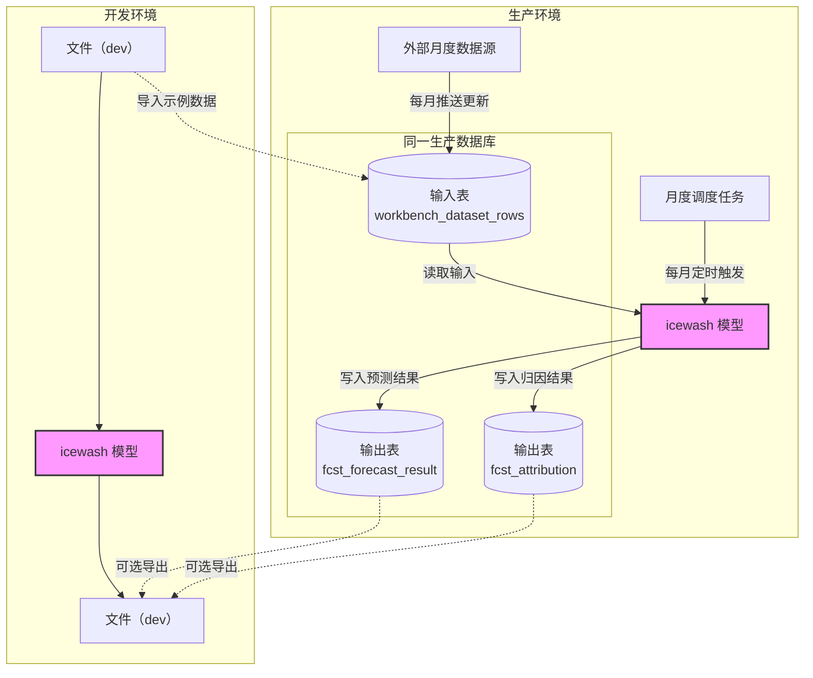
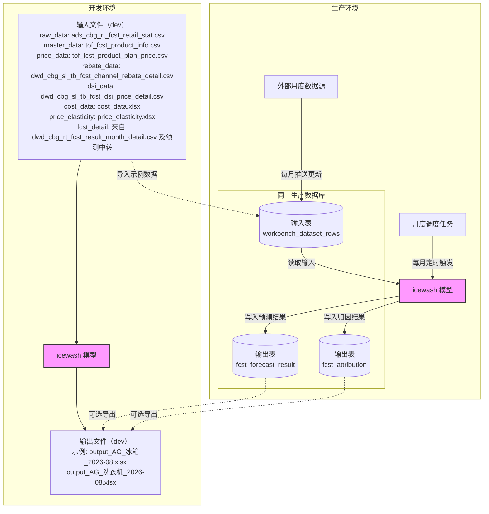

可以定位。结论是：迁移脚本只建表，不负责导入数据；具体见 [0003_relay_and_chat_extension.py](D:/Workspace/LCT-predict-agent/backend/alembic/versions/0003_relay_and_chat_extension.py:28)。

数据由 [seed_workbench.py](D:/Workspace/LCT-predict-agent/backend/src/app/seed_workbench.py:31) 和模型参考接口写入：

| dataset | 实际来源 |
|---|---|
| `raw_data` | [ads_cbg_rt_fcst_retail_stat.csv](D:/Workspace/LCT-predict-agent/services/icewash-model/data/ads_cbg_rt_fcst_retail_stat.csv) |
| `master_data` | [tof_fcst_product_info.csv](D:/Workspace/LCT-predict-agent/services/icewash-model/data/tof_fcst_product_info.csv) |
| `price_data` | [tof_fcst_product_plan_price.csv](D:/Workspace/LCT-predict-agent/services/icewash-model/data/tof_fcst_product_plan_price.csv) |
| `rebate_data` | [dwd_cbg_sl_tb_fcst_channel_rebate_detail.csv](D:/Workspace/LCT-predict-agent/services/icewash-model/data/dwd_cbg_sl_tb_fcst_channel_rebate_detail.csv) |
| `dsi_data` | [dwd_cbg_sl_tb_fcst_dsi_price_detail.csv](D:/Workspace/LCT-predict-agent/services/icewash-model/data/dwd_cbg_sl_tb_fcst_dsi_price_detail.csv) |
| `cost_data` | [cost_data.xlsx](D:/Workspace/LCT-predict-agent/services/icewash-model/data/reference/cost_data.xlsx) |
| `price_elasticity` | [price_elasticity.xlsx](D:/Workspace/LCT-predict-agent/services/icewash-model/data/reference/price_elasticity.xlsx) |
| `fcst_detail` | 主要来自 [dwd_cbg_rt_fcst_result_month_detail.csv](D:/Workspace/LCT-predict-agent/services/icewash-model/data/dwd_cbg_rt_fcst_result_month_detail.csv)，同时包含模型预测结果中转数据 |

当前数据库中：

- 前 6 个 CSV 数据集按代码设置了行数上限，例如 `raw_data` 最多导入 2500 行。
- `cost_data`：110 行，`price_elasticity`：72 行。
- `fcst_detail`：共 11112 行，其中约 5911 行来自 CSV，5201 行来自模型预测结果 `fcst_forecast_result` 的中转。
- 当前 `AG_冰箱_2026-08` 的 5201 行对应生成文件 [output_AG_冰箱_2026-08.xlsx](D:/Workspace/LCT-predict-agent/services/icewash-model/cbg_fcst_month/output_AG_冰箱_2026-08.xlsx)，但正常链路实际是“模型写 PG → backend 中转”，不是 backend 直接读取 Excel，见 [forecast_relay_ingest.py](D:/Workspace/LCT-predict-agent/backend/src/app/services/forecast_relay_ingest.py:131)。

另外，`cost_data.xlsx` 和 `price_elasticity.xlsx` 的初始设计来源分别是 [商品成本.xlsx](D:/Workspace/LCT-predict-agent/docs/UI设计稿/商品成本.xlsx) 和 [价格弹性表.xlsx](D:/Workspace/LCT-predict-agent/docs/UI设计稿/价格弹性表.xlsx)，但当前运行时以 `services/icewash-model/data/reference/` 下的文件为准；成本文件还支持上传替换。

表结构本身没有 `source_file` 字段，所以只看数据库无法直接知道文件名，必须结合导入代码和模型接口才能完成上述定位。


`workbench_dataset_rows` 表的 `dataset` 列有 **8 个唯一值**（不包含 NULL）。

8 个唯一值是：

1. `cost_data`
2. `dsi_data`
3. `fcst_detail`
4. `master_data`
5. `price_data`
6. `price_elasticity`
7. `raw_data`
8. `rebate_data`

预期设计：




当前阶段：输入数据目前仍是“文件驱动”；预测输出已经是“Excel + PostgreSQL 双写”；前端工作台主要读取 PostgreSQL，而不是直接读取 Excel。



先说结论：

- `output_AG_冰箱_2026-08.xlsx` 是一次真实预测任务的自动导出结果，不是手工制作。
- `output_T14_20260902_0445.xlsx` 是 T14 栈自检任务生成的另一份真实预测结果，不是复制粘贴，也不是单纯格式校验文件。
- “预测结果”页面读取的是 PostgreSQL 中已有的预测快照，只支持查询、筛选、分页和导出，不会触发新的预测或扰动计算。

## 两个文件的区别

| 文件 | 用途 | 内容 |
|---|---|---|
| [output_AG_冰箱_2026-08.xlsx](D:/Workspace/LCT-predict-agent/services/icewash-model/cbg_fcst_month/output_AG_冰箱_2026-08.xlsx) | 正常冰箱预测任务 | `预测详情` 5201 行，只有冰箱 |
| [output_T14_20260902_0445.xlsx](D:/Workspace/LCT-predict-agent/services/icewash-model/cbg_fcst_month/output_T14_20260902_0445.xlsx) | T14 栈联调/验收任务 | `预测详情` 10339 行，冰箱 5201 行 + 洗衣机 5138 行 |

T14 请求的 `systemForecastNumber` 就是 `T14_20260902_0445`，同时请求了冰箱和洗衣机。它实际运行了模型：

- 生成预测明细：10339 行
- 生成白盒归因：29628 行
- 训练了 48 个 LightGBM 模型
- 写入了 `fcst_forecast_result` 和 `fcst_attribution`

因此它不是复制文件。两份文件虽然都包含冰箱 5201 个明细键，但 T14 还有洗衣机数据，且冰箱部分也存在字段差异；T14 还多了 4 个特征列。

T14 的任务定义见 [T14-icewash-stack-check-2026-09-01.md](D:/Workspace/LCT-predict-agent/docs/plans/T14-icewash-stack-check-2026-09-01.md:33)。

## 你说的“最外层文件”

你消息里列出的两个路径实际都在：

```text
services/icewash-model/cbg_fcst_month/
```

另外根目录下还有两份更早的离线样例：

- [output_AG_冰箱_20260813_222432.xlsx](D:/Workspace/LCT-predict-agent/services/icewash-model/output_AG_冰箱_20260813_222432.xlsx)
- [output_AG_洗衣机_20260814_091212.xlsx](D:/Workspace/LCT-predict-agent/services/icewash-model/output_AG_洗衣机_20260814_091212.xlsx)

这两份是原始文件型阶段留下的旧预测产物，预测月份和当前结果不同，不是当前“预测结果”页面的主要数据来源。

## “预测结果”页面读取什么

[ResultsPage.tsx](D:/Workspace/LCT-predict-agent/frontend/src/pages/ResultsPage.tsx:13) 固定使用 `fcst_detail` 数据集。

页面实际调用：

```text
GET /api/workbench/filter-options/fcst_detail
GET /api/workbench/tables/fcst_detail
GET /api/workbench/charts/fcst_detail
```

后端从 PostgreSQL 的 `workbench_dataset_rows` 查询，见 [workbench.py](D:/Workspace/LCT-predict-agent/backend/src/app/services/workbench.py:178)。

所以它可以理解为“数据库里的预测结果缓存/中转快照”，但不是浏览器缓存。目前这个表中有：

```text
AG_冰箱_2026-08    5201 行
```

T14 的 10339 行目前只在：

```text
fcst_forecast_result
fcst_attribution
```

中，尚未被 relay 到 `workbench_dataset_rows`，因此预测结果页面默认不会展示 T14。

页面本身不支持扰动。扰动属于 What-if 页面，通过 `simulate` / `optimize` 单独调用模型。

## 当前模型预测数据来源

模型核心计算目前仍然直接读取本地 CSV，而不是读取 PostgreSQL：

- 历史销量：[ads_cbg_rt_fcst_retail_stat.csv](D:/Workspace/LCT-predict-agent/services/icewash-model/data/ads_cbg_rt_fcst_retail_stat.csv)
- 产品主数据：[tof_fcst_product_info.csv](D:/Workspace/LCT-predict-agent/services/icewash-model/data/tof_fcst_product_info.csv)
- 计划价格：[tof_fcst_product_plan_price.csv](D:/Workspace/LCT-predict-agent/services/icewash-model/data/tof_fcst_product_plan_price.csv)
- 渠道返利：[dwd_cbg_sl_tb_fcst_channel_rebate_detail.csv](D:/Workspace/LCT-predict-agent/services/icewash-model/data/dwd_cbg_sl_tb_fcst_channel_rebate_detail.csv)
- DSI 价格：[dwd_cbg_sl_tb_fcst_dsi_price_detail.csv](D:/Workspace/LCT-predict-agent/services/icewash-model/data/dwd_cbg_sl_tb_fcst_dsi_price_detail.csv)
- 历史/手工预测结果：[dwd_cbg_rt_fcst_result_month_detail.csv](D:/Workspace/LCT-predict-agent/services/icewash-model/data/dwd_cbg_rt_fcst_result_month_detail.csv)
- LightGBM 模型文件：[model_file](D:/Workspace/LCT-predict-agent/services/icewash-model/cbg_fcst_month/model_file)

读取逻辑在 [dataloader.py](D:/Workspace/LCT-predict-agent/services/icewash-model/cbg_fcst_month/dataloader.py:109)。

当前架构实际上是“双写”：

1. 模型读取 CSV 和模型文件进行预测；
2. 自动生成 Excel，代码见 [output.py](D:/Workspace/LCT-predict-agent/services/icewash-model/cbg_fcst_month/output.py:342)；
3. 同时将预测明细和归因写入 PostgreSQL，见 [pg_sync.py](D:/Workspace/LCT-predict-agent/services/icewash-model/cbg_fcst_month/pg_sync.py:103)；
4. backend 再把 PG 中的模型结果同步到 `workbench_dataset_rows`。

所以你的理解需要修正为：

> 输入数据目前仍是“文件驱动”；预测输出已经是“Excel + PostgreSQL 双写”；前端工作台主要读取 PostgreSQL，而不是直接读取 Excel。